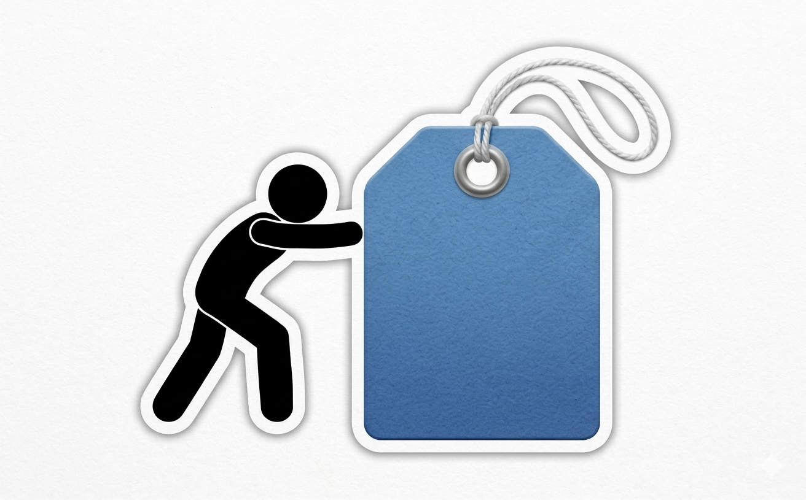

# PUSHING TAG

<p align="center">
  
</p>

Play your producer tag every time you `git push`.

```
$ git push origin main
...
[plays your tag.mp3]
```

---

## Install

```bash
npm install -g pushingtag
```

Then run setup once to hook it into your shell:

```bash
pushingtag setup
source ~/.zshrc   # or ~/.bashrc
```

---

## Usage

### Set your tag

Point pushingtag at your `.mp3` file:

```bash
pushingtag set ./my-tag.mp3
```

### Push as normal

From now on, every successful `git push` plays your tag automatically:

```bash
git push origin main
# your tag plays in the background
```

### Commands

| Command                 | Description                                 |
| ----------------------- | ------------------------------------------- |
| `pushingtag setup`      | Install the shell wrapper into your rc file |
| `pushingtag set <path>` | Set your producer tag `.mp3`                |
| `pushingtag play`       | Play your tag manually                      |
| `pushingtag on`         | Enable auto-play on push                    |
| `pushingtag off`        | Disable auto-play on push                   |
| `pushingtag status`     | Show current config and install status      |
| `pushingtag uninstall`  | Remove the shell wrapper from your rc file  |

---

## How it works

`pushingtag setup` injects a `git()` shell function into your rc file. The function wraps the real `git` binary — on a successful `push`, it fires `pushingtag play` in the background without blocking your terminal.

---

## Requirements

- Node.js >= 20
- macOS or Linux
- A system audio player (`afplay` on macOS, `mpg123` / `ffplay` on Linux)

---

## Uninstall

```bash
pushingtag uninstall
npm uninstall -g pushingtag
```
